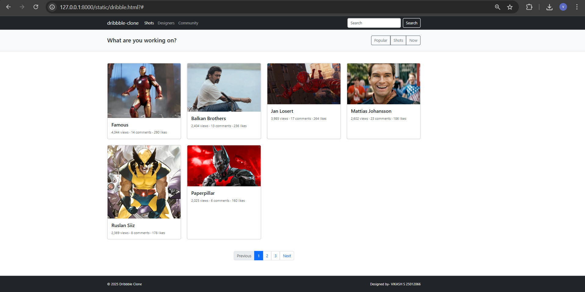

# Project Responsive Web Design using Bootstrap
## Date: 19.10.2025

## AIM:
To create a simplified clone of Dribbble (https://dribbble.com/) landing page.


## DESIGN STEPS:

### Step 1:
Clone the repository from GitHub.

### Step 2:
Create Django Admin project.

### Step 3:
Create a New App under the Django Admin project.

### Step 4:
Insert the necessary CSS and JavaScript files as external in order to use Bootstrap.

### Step 5:
Create a HTML file and include the needed Bootstrap components.

### Step 6:
Publish the website in the LocalHost.

## PROGRAM :
```
<!doctype html>
<html lang="en">
  <head>
    <meta charset="utf-8">
    <meta name="viewport" content="width=device-width, initial-scale=1">
    <title>Dribbble - Simplified Clone</title>
    <!-- Bootstrap 5 CDN -->
    <link href="https://cdn.jsdelivr.net/npm/bootstrap@5.3.2/dist/css/bootstrap.min.css" rel="stylesheet">
  </head>
  <body>

    <!-- NAVBAR -->
    <nav class="navbar navbar-expand-lg navbar-dark bg-dark">
      <div class="container">
        <a class="navbar-brand" href="#">dribbble-clone</a>
        <button class="navbar-toggler" type="button" data-bs-toggle="collapse" data-bs-target="#navMenu" aria-controls="navMenu" aria-expanded="false" aria-label="Toggle navigation">
          <span class="navbar-toggler-icon"></span>
        </button>

        <div class="collapse navbar-collapse" id="navMenu">
          <ul class="navbar-nav me-auto mb-2 mb-lg-0">
            <li class="nav-item"><a class="nav-link active" href="#">Shots</a></li>
            <li class="nav-item"><a class="nav-link" href="#">Designers</a></li>
            <li class="nav-item"><a class="nav-link" href="#">Community</a></li>
          </ul>
          <form class="d-flex" role="search">
            <input class="form-control me-2" type="search" placeholder="Search" aria-label="Search">
            <button class="btn btn-outline-light" type="submit">Search</button>
          </form>
        </div>
      </div>
    </nav>

    <header class="bg-light py-4 border-bottom">
      <div class="container">
        <div class="d-flex flex-column flex-md-row justify-content-between align-items-center">
          <h1 class="h4 mb-2 mb-md-0">What are you working on?</h1>
          <div>
            <div class="btn-group" role="group" aria-label="filters">
              <button class="btn btn-outline-secondary">Popular</button>
              <button class="btn btn-outline-secondary">Shots</button>
              <button class="btn btn-outline-secondary">Now</button>
            </div>
          </div>
        </div>
      </div>
    </header>

    <!-- CONTENT GRID -->
    <main class="py-5">
      <div class="container">
        <div class="row g-4">
          <!-- card 1 -->
          <div class="col-12 col-sm-6 col-md-4 col-lg-3">
            <div class="card h-100">
              
              <div class="card-body">
                <h5 class="card-title">Famous</h5>
                <p class="card-text small text-muted mb-0">4,044 views · 14 comments · 290 likes</p>
              </div>
            </div>
          </div>

          <!-- card 2 -->
          <div class="col-12 col-sm-6 col-md-4 col-lg-3">
            <div class="card h-100">
              
              <div class="card-body">
                <h5 class="card-title">Balkan Brothers</h5>
                <p class="card-text small text-muted mb-0">2,404 views · 13 comments · 236 likes</p>
              </div>
            </div>
          </div>

          <!-- card 3 -->
          <div class="col-12 col-sm-6 col-md-4 col-lg-3">
            <div class="card h-100">
              
              <div class="card-body">
                <h5 class="card-title">Jan Losert</h5>
                <p class="card-text small text-muted mb-0">3,985 views · 17 comments · 264 likes</p>
              </div>
            </div>
          </div>

          <!-- card 4 -->
          <div class="col-12 col-sm-6 col-md-4 col-lg-3">
            <div class="card h-100">
              
              <div class="card-body">
                <h5 class="card-title">Mattias Johansson</h5>
                <p class="card-text small text-muted mb-0">2,602 views · 23 comments · 186 likes</p>
              </div>
            </div>
          </div>

          <div class="col-12 col-sm-6 col-md-4 col-lg-3">
            <div class="card h-100">
              
              <div class="card-body">
                <h5 class="card-title">Ruslan Siiz</h5>
                <p class="card-text small text-muted mb-0">2,369 views · 8 comments · 178 likes</p>
              </div>
            </div>
          </div>

          <div class="col-12 col-sm-6 col-md-4 col-lg-3">
            <div class="card h-100">
              
              <div class="card-body">
                <h5 class="card-title">Paperpillar</h5>
                <p class="card-text small text-muted mb-0">2,025 views · 6 comments · 160 likes</p>
              </div>
            </div>
          </div>

        </div>

        <!-- pagination -->
        <div class="d-flex justify-content-center mt-5">
          <nav aria-label="Page navigation">
            <ul class="pagination">
              <li class="page-item disabled"><a class="page-link" href="#">Previous</a></li>
              <li class="page-item active"><a class="page-link" href="#">1</a></li>
              <li class="page-item"><a class="page-link" href="#">2</a></li>
              <li class="page-item"><a class="page-link" href="#">3</a></li>
              <li class="page-item"><a class="page-link" href="#">Next</a></li>
            </ul>
          </nav>
        </div>

      </div>
    </main>

    <!-- FOOTER -->
    <footer class="bg-dark text-light py-4">
      <div class="container d-flex flex-column flex-md-row justify-content-between align-items-center">
        <small>© <span id="year"></span> Dribbble Clone</small>
        <small>Designed by- VIKASH S  25012066</small>
      </div>
    </footer>

    <script src="https://cdn.jsdelivr.net/npm/bootstrap@5.3.2/dist/js/bootstrap.bundle.min.js"></script>
    <script>document.getElementById('year').textContent = new Date().getFullYear();</script>
  </body>
</html>

```

## OUTPUT:


## RESULT:
The Project for responsive web design using Bootstrap is completed successfully.
